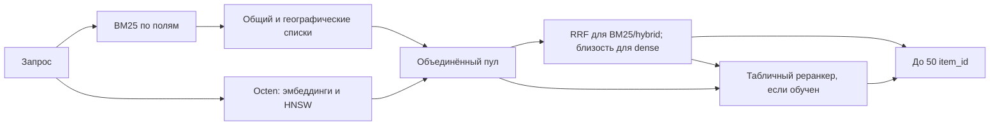
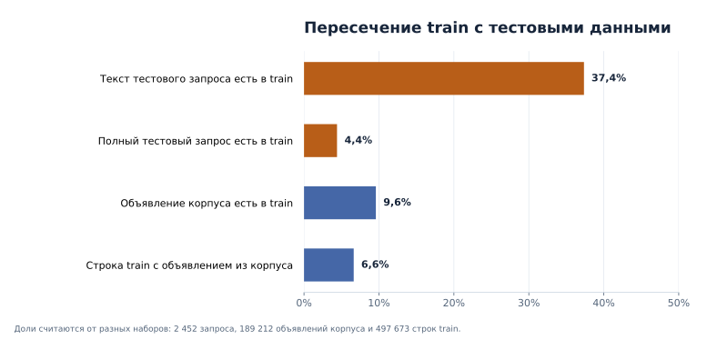
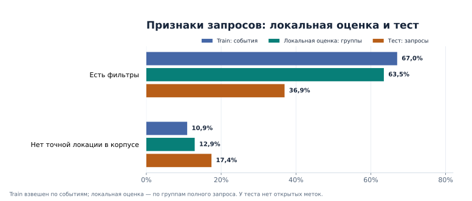
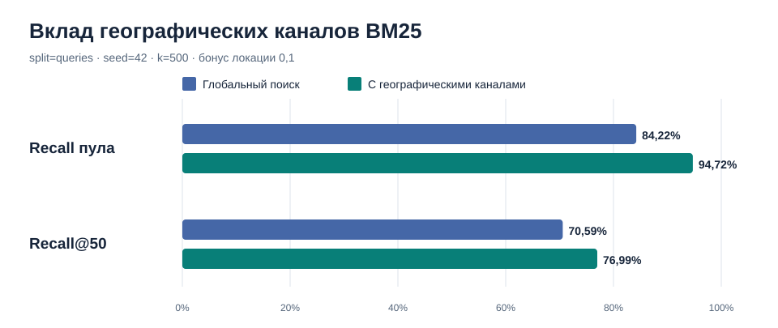
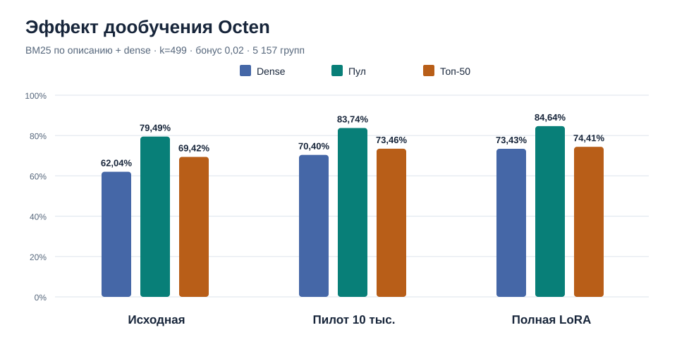

# Поиск объявлений для запросов Авито

Проект решает задачу кандидатогенерации: для каждого поискового запроса нужно
выбрать до 50 объявлений из корпуса. Качество оценивается по Recall@50.

Краткое описание данных, признаков, алгоритмов, проверки и основных ошибок —
в [описании решения](SOLUTION.md).

В проекте есть три режима поиска:

- `bm25` отдельно ищет по заголовкам, параметрам и описаниям;
- `dense` ищет близкие по смыслу объявления с помощью эмбеддингов;
- `hybrid` объединяет BM25-каналы и dense-поиск с помощью RRF.

В ответ попадают до 50 лучших объявлений.

Дополнительно доступен обучаемый табличный реранкер: он выбирает финальные 50
из полного пула BM25, dense или hybrid. Он использует ранги каналов, текстовые
совпадения, совпадение локации и параметры объявления. Реализация построена на
`HistGradientBoostingClassifier` из scikit-learn; она работает локально и не
требует нового внешнего API.



Географические списки отбирают объявления нужной локации **до** ограничения
глубины каждого BM25-канала. Общие списки при этом сохраняются. В режимах
`bm25` и `hybrid` RRF выбирает финальные 50 из объединённого пула; в `dense`
их задаёт близость эмбеддингов. Если включён реранкер, оценки и ранги поиска
становятся его признаками, и он повторно выбирает 50 из того же пула.

Навигация: [описание решения](SOLUTION.md) ·
[данные и результаты](#что-показали-данные-и-эксперименты) ·
[установка](#установка) · [команды](#команды) ·
[карта проекта](#карта-проекта) · [проверка качества](#как-устроена-проверка-качества).

## Что показали данные и эксперименты

### Данные и ограничения проверки

Для локальной проверки используем корпус из 189 212 объявлений
`benchmark_items.parquet` и разбиение `--split queries --seed 42`: все варианты
одного текста запроса остаются по одну сторону разбиения. В train — 497 673
выбранные пары, но только 33 010 из них относятся к этому корпусу. На
отложенной части это 6 837 из 93 616 строк, или 5 157 групп запросов.
В train встречаются лишь 18 142 разных объявления корпуса — 9,6% от него.
Остальные выбранные объявления отсутствуют в проверочном корпусе и в Recall
не участвуют. Локальная оценка полезна для сравнения настроек на одинаковых
данных, но её абсолютное значение нельзя считать прогнозом результата сдачи.



Сами запросы тоже отличаются. У 5 157 локальных групп — 2 431 уникальный
нормализованный текст; у 2 452 тестовых запросов — 2 451. Фильтры заданы у
63,5% локальных групп и 36,9% тестовых запросов. Для 427 тестовых запросов
(17,4%) в корпусе вообще нет объявления с точным `location_id`. Поэтому
запоминать пары из train недостаточно: в нём встречались только 37,4% текстов
тестовых запросов и 4,4% полных сочетаний всех поисковых признаков.
Географию используем как сигнал и добавляем отдельные географические каналы,
сохраняя глобальный поиск. Жёсткое ограничение одним городом потеряло бы
часть подходящих объявлений.



### Кандидаты и география

На одном локальном разбиении BM25 с глубиной 500 и географическими каналами
поднял Recall всего пула с 0,8422 до 0,9472, а Recall@50 — с 0,7059 до
0,7699. Табличный реранкер на том же BM25-пуле дал 0,7955 в отдельном прогоне
на Mac. Бонус `0.1` в **гибридном** RRF с двумя каналами практически
ставит все найденные объявления точной локации выше остальных: максимальный
балл без бонуса равен примерно `2/61 ≈ 0,0328`. Для опытов с дообученной
Octen использовали более мягкий бонус `0.02`; влияние географии и качество
выбора финальных 50 проверяем отдельно.



### Дообучение Octen и итоговая проверка

По отчётам запусков на ПК дообученную Octen сравнивали с исходной моделью
при одинаковых настройках:
BM25 только по описанию плюс dense-поиск, по 499 кандидатов, `ef-search=1000`,
длина 128 токенов, бонус локации `0.02`. Все значения ниже относятся к тем же
5 157 локальным группам:

| Эмбеддинги | Recall пула | Recall dense-канала | Recall@50 |
| --- | ---: | ---: | ---: |
| Исходная Octen | 0,7949 | 0,6204 | 0,6942 |
| LoRA, пилот на 10 тыс. пар | 0,8374 | 0,7040 | 0,7346 |
| LoRA, полное обучение | **0,8464** | **0,7343** | **0,7441** |



Полную модель оставили для следующего этапа: она улучшила и Recall пула, и
итоговые 50 на этой проверке. Затем на расширенном hybrid-пуле с тем же
бонусом `0.02` табличный реранкер поднял локальный Recall@50 с **0,8031 до
0,8199**. Это отдельный эксперимент с другим пулом, поэтому напрямую
сравнивать его с таблицей эмбеддингов нельзя.

### Результат отдельной ветки с новыми признаками

В [ветке `improve-validation-microcat-geo`](https://github.com/Alexeyokey/avitotestproject/tree/improve-validation-microcat-geo)
к реранкеру добавлены признаки микрокатегории и статистики выбора локаций.
Обучение микрокатегорийного признака исключает собственный текст запроса при
подготовке обучающих строк. Отдельный географический поиск по связанным
локациям заполняет только свободные места в пуле до лимита 998: у его списков
нулевой вес RRF, поэтому они доступны реранкеру, но не вытесняют кандидатов
точной локации и глобального поиска при объединении. Классификатор в
описанном эксперименте остаётся `HistGradientBoostingClassifier`. Ветка
также содержит сценарий оценки с перевзвешиванием по наблюдаемым
признакам тестовых запросов; такое перевзвешивание не устраняет смещение
известных положительных объявлений.

В [описании результата ветки](https://github.com/Alexeyokey/avitotestproject/blob/improve-validation-microcat-geo/solution_description.md)
приведено парное сравнение на одном пуле и разбиении по текстам запросов
(`seed=42`, 5 157 отложенных групп):

| Отбор финальных 50 | Локальный Recall@50 |
| --- | ---: |
| Исходный RRF | 0,80313 |
| Прежний табличный реранкер | 0,81985 |
| Реранкер с новыми признаками | **0,84376** |

Относительно прежнего реранкера прирост составил **2,39 процентного пункта**.
В описании ветки указан 95% кластерный bootstrap-интервал для парной разницы
по текстам запросов: **[1,72; 3,11] п. п.** Recall пула — **0,91664**, средний
размер пула — **783,47** объявления. Модель обучалась на 21 392 группах
обучающей части. Эти числа взяты из описания ветки: сами по-запросные отчёты
и веса реранкера в Git не размещены, поэтому независимо пересчитать результат
по опубликованным файлам пока нельзя. Код новой модели остаётся в отдельной
ветке; результат скрытого теста для неё здесь не заявлен.

### Результаты на тестовых запросах

| Отправка на платформу | Recall@50 |
| --- | ---: |
| Первая | 0,736234 |
| Следующий сообщённый результат | 0,763 |
| Последний сообщённый результат | **0,764** |

Последний результат выше первого на **2,78 процентного пункта**. Точные
конфигурации файлов для результатов 0,763 и 0,764 в репозитории пока не
зафиксированы, поэтому их нельзя приписать конкретному варианту реранкера
или напрямую сопоставить с его локальным результатом 0,84376.

По одной итоговой метрике для каждой отправки нельзя понять, какая часть
потерь возникла при поиске кандидатов, а какая — при выборе 50 реранкером.
Следующее сравнение нужно делать на одном сохранённом пуле, с реранкером и
без него, отдельно для запросов с фильтрами, без фильтров и без точной
локации. При оценке новых вариантов также будем учитывать распределение
тестовых запросов, а не только среднее по локальным группам.

Числа экспериментов лежат в `docs/readme-results.json`. Графики по данным
пересчитываются из трёх Parquet-файлов. Для их обновления установите
Matplotlib и выполните:

```bash
pip install -e '.[plots]'
python scripts/analyze_dataset_for_readme.py --data-dir dataset
python scripts/plot_dataset_analysis.py
python scripts/render_readme_charts.py
```

## Установка

Нужен Python 3.11 или новее.

```bash
python -m venv .venv
source .venv/bin/activate
pip install -r requirements-lock.txt
pip install -e . --no-deps
```

В Windows окружение активируется командой `.venv\Scripts\Activate.ps1`.

Для режимов `dense` и `hybrid` установите дополнительные зависимости:

```bash
pip install -e '.[dense]'
```

Положите `train.parquet`, `benchmark_queries.parquet` и
`benchmark_items.parquet` в папку `dataset`. Вместо этого можно передать
абсолютный путь к папке с данными через `--data-dir`.

## Команды

Запустить тесты:

```shell
python -m unittest discover -s tests -v
```

Посмотреть основные пересечения между обучающей выборкой и бенчмарком:

```shell
avito profile --data-dir dataset --output artifacts/profile.json
```

Проверить качество на отложенных парах «запрос — объявление»:

```shell
avito evaluate --data-dir dataset --split pairs --output artifacts/bm25-pairs.json
```

Проверить качество на отложенных текстах запросов:

```shell
avito evaluate --data-dir dataset --split queries --output artifacts/bm25-queries.json
```

По умолчанию в проверку попадает около 20% строк. `evaluate` читает train
порциями по 32 768 строк и сохраняет в памяти только отложенные ответы,
которые есть в корпусе. Размер порции меняется через `--train-batch-size`.
Долю можно изменить, например:

```shell
avito evaluate --data-dir dataset --split queries --validation-fraction 0.1 \
  --output artifacts/bm25-queries-10pct.json
```

Проверить по всем строкам `train.parquet`, чьи объявления есть в корпусе:

```shell
avito evaluate --data-dir dataset --split all \
  --output artifacts/bm25-all.json
```

Для быстрого пробного запуска можно добавить `--max-queries 200`; это ограничит
число оцениваемых запросов после выбора строк, даже при `--split all`.

Три поля индексируются отдельно и объединяются через RRF. Настройки по умолчанию:

| Поле | `k1` | `b` | Вес |
|---|---:|---:|---:|
| Заголовок | 1.0 | 0.2 | 2.0 |
| Параметры | 1.2 | 0.7 | 1.0 |
| Описание | 1.0 | 0.8 | 0.5 |

Настройки меняются через `--title-k1`, `--title-b`, `--title-weight` и такие же
аргументы с префиксами `params` и `description`. `--k1` и `--b` переопределяют
значение сразу для всех трёх полей. Внутри BM25 используется `--bm25-rrf-k 30`
и квота `--bm25-channel-quota 10`.

Для эксперимента с русским стеммингом включите отдельные каналы заголовка и
параметров объявления. Исходные BM25-каналы при этом остаются включёнными:

```shell
avito evaluate --data-dir dataset --split queries --method bm25 --candidate-k 200 \
  --stem-title-weight 0.5 --stem-params-weight 0.25 \
  --output artifacts/bm25-stem-k200-queries.json
```

Нулевые веса (значения по умолчанию) отключают новые каналы и воспроизводят
прежний baseline. Стемминг реализован локальной библиотекой `snowballstemmer`;
дополнительные словари или обращения к API не требуются.

Более сильный сигнал — точное совпадение локации запроса и объявления. Параметр
`--location-bonus` добавляет совпавшим объявлениям оценку при сборке топ-50 из
уже найденного пула. Он не удаляет объявления из других локаций и не расширяет
пул. Нулевое значение (по умолчанию) сохраняет прежний результат:

```shell
avito evaluate --data-dir dataset --split queries --method bm25 \
  --candidate-k 200 --stem-title-weight 0.5 --stem-params-weight 0.25 \
  --location-bonus 0.1 --output artifacts/bm25-stem-location-queries.json
```

На том же разбиении `queries` (5 157 запросов) эта настройка дала Recall@50
0.5537 против 0.2756 без бонуса. Recall исходного пула в обоих случаях 0.7102:
бонус меняет только выбор 50 кандидатов. Оценка построена по положительным
парам, чьи объявления присутствуют в `benchmark_items.parquet`; это 7.3%
отложенных строк, поэтому результат не следует считать точной оценкой скрытого
бенчмарка. Этот опыт относится к BM25; для гибрида бонус подбирается отдельно.

На одинаковой валидации `--split queries` (5 157 запросов) исходный BM25 с
`--candidate-k 250` получил Recall пула 0.6842 и Recall@50 0.2673 при среднем
размере пула 578. Новый вариант с настройками выше получил соответственно
0.7102 и 0.2756 при среднем размере пула 567. Это сравнение показывает вклад
стемминга при близком числе кандидатов; нулевые веса сохраняют исходный режим.

### География до ограничения числа кандидатов

`--geo-candidate-k` добавляет для каждого включённого поля BM25 отдельный
географический список. Поиск в нём ограничивается подходящими локациями **до**
выбора top-K, поэтому он может вернуть местное объявление за пределами
глобального top-K. Глобальные списки остаются, и объявления из других локаций
не исключаются. Если в корпусе есть объявления с `item_location_id`, равным
`search_location_id`, используется этот ID. Иначе берутся до
`--geo-top-locations` локаций объявлений, которые чаще выбирали при поиске с
данным ID. При числе обучающих строк меньше `--geo-min-history` остаётся только
глобальный поиск. Названия городов и административная иерархия не требуются.

Для честного сравнения выполните команды на одном разбиении:

```shell
avito evaluate --data-dir dataset --split queries --seed 42 \
  --method bm25 --candidate-k 500 \
  --stem-title-weight 0.5 --stem-params-weight 0.25 \
  --location-bonus 0.1 --bm25-channel-quota 0 \
  --output artifacts/bm25-geo-control.json

avito evaluate --data-dir dataset --split queries --seed 42 \
  --method bm25 --candidate-k 500 \
  --stem-title-weight 0.5 --stem-params-weight 0.25 \
  --location-bonus 0.1 --bm25-channel-quota 0 \
  --geo-candidate-k 100 --geo-top-locations 3 \
  --geo-min-history 20 --geo-weight 0.25 \
  --output artifacts/bm25-geo-k100.json
```

При оценке связи локаций считаются только по обучающей части train; при
`predict` используется весь train. При `evaluate --split all` связи не
обучаются, так как независимой обучающей части нет, но канал точного совпадения
продолжает работать. Нулевой `--geo-candidate-k` сохраняет прежний поиск.
В отчёте `geography_slices` показывает Recall по наличию точной локации и по
местным/неместным положительным объявлениям. `geo_channel_contribution`
показывает дополнительные объявления и положительные пары, попавшие в пул
только благодаря новым спискам. Эти диагностики помогают отделить пополнение
пула от изменения порядка итоговых 50.

На полном разбиении `queries`, `seed=42` (5 157 групп), конфигурация выше дала:

| Показатель | Глобальный BM25 | С географическими списками |
| --- | ---: | ---: |
| Recall пула | 0.8422 | 0.9472 |
| Recall@50 | 0.7059 | 0.7699 |
| Средний размер пула | 1 265 | 1 354 |
| Recall@50 без точного ID локации в корпусе | 0.3158 | 0.4193 |
| Recall@50 неместных положительных объявлений | 0.2889 | 0.3431 |

Дополнительные списки нашли новую положительную пару у 584 групп. По Recall@50
улучшились 479 групп, ухудшились 122, не изменились 4 556. Парная оценка
неопределённости с кластеризацией по 2 431 уникальному тексту дала интервал
прироста 3.76–9.52 процентного пункта. Эти числа относятся к локальной
валидации: в ней учитываются лишь известные положительные объявления из
`benchmark_items`, а состав запросов отличается от бенчмарка.

Первый запуск семантического поиска скачивает модель
[`Octen/Octen-Embedding-0.6B`](https://huggingface.co/Octen/Octen-Embedding-0.6B),
кодирует корпус и сохраняет HNSW-индекс в `artifacts/dense`. Модель содержит
около 0.6 млрд параметров; загрузка и индексация потребуют больше времени и
памяти, чем с прежней `intfloat/multilingual-e5-small`. Следующие команды
используют готовый индекс. На Mac с Apple
Silicon можно передать `--device mps`; если этот режим работает нестабильно,
используйте `--device cpu`.

Для Octen применяются опубликованные вместе с моделью промпты `query` и
`document`. Префиксы `query:` и `passage:` используются только при явном выборе
модели семейства E5 через `--embedding-model`. При смене модели создаётся новый
индекс. Локальный чекпойнт дообученной Octen использует те же промпты, если
они сохранены в конфигурации Sentence Transformers. Изменение файлов
локального чекпойнта обновляет ключ кеша и перестраивает индекс. Размер пакета
для Octen по умолчанию уменьшен до 16; его можно изменить
через `--embedding-batch-size`. Этот параметр теперь применяется и к запросам:
при `evaluate` и `predict` dense-запросы кодируются и ищутся в HNSW пакетами,
а BM25 и объединение результатов по-прежнему выполняются для каждого запроса.

Dense-тексты ограничены 128 токенами через `--embedding-max-length`. Во время
первой индексации сохраняются контрольные точки, поэтому прерванный запуск можно
продолжить. На Mac с достаточной памятью можно попробовать увеличить
`--embedding-batch-size` до 32.

В dense-текст входят полный заголовок, первые 40 слов параметров и первые 48 слов
описания, а также категория объявления. Dense-запрос состоит из текста
запроса, выбранных фильтров и категории. Категория `0` означает поиск без
ограничения и не добавляется. Бюджеты меняются через `--embedding-params-words` и
`--embedding-description-words`. Изменение любого из этих значений создаёт новый
индекс, потому что векторы корпуса должны быть рассчитаны заново.

Сначала отдельно измерьте dense-поиск:

```bash
avito evaluate --data-dir dataset --split queries --method dense --device mps \
  --output artifacts/dense-queries.json
```

Затем проверьте объединение с BM25:

```bash
avito evaluate --data-dir dataset --split queries --method hybrid --device mps \
  --output artifacts/hybrid-queries.json
```

Гибридный поиск берёт по 300 кандидатов из заголовка, параметров, описания и
dense-поиска, после чего объединяет четыре списка одним RRF. Вес BM25 распределяется
между тремя полями в пропорции `2 / 1 / 0.5`. Квота каналов по умолчанию отключена: все
50 мест определяет RRF. Её можно включить через `--channel-quota`. Параметры можно менять через `--candidate-k`, `--rrf-k`,
`--bm25-weight`, `--dense-weight` и `--channel-quota`.

Отчёт `evaluate` для каждого метода дополнительно показывает `candidate_pool_recall` —
Recall по всем уникальным кандидатам, найденным до обрезки до 50, средний размер пула,
долю запросов с полным покрытием и потерю Recall при обрезке. Для BM25 пул объединяет
до `--candidate-k` результатов каждого включённого поля; для dense это первые
`--candidate-k` результатов, для hybrid — объединение всех включённых каналов.
Метрика считается по тем же отложенным запросам и объявлениям корпуса, что и Recall@50.
Для `bm25` и `hybrid` рядом с JSON-отчётом сохраняется файл `<имя>.rrf.csv`:
по одной строке на каждое объявление итогового топ-50. В нём есть нормализованные
поля запроса, `rank`, `item_id` и `rrf_score` — сумма вкладов RRF по каналам
вместе с бонусом точного совпадения локации, если он включён. Раздел
`retrieval_diagnostics.rrf_scores` в JSON содержит путь к CSV, число строк,
средний, минимальный и максимальный балл. При использовании обученного
реранкера CSV сохраняет балл исходного retrieval для выбранных им объявлений;
это не вероятность реранкера. Для чистого `dense` RRF не применяется, поэтому
значение `rrf_scores` равно `null`. Формат `answer.csv` не меняется.
Отчёт для `hybrid` также показывает Recall каждого канала и сравнивает Recall@50
без квоты и с квотой 10; поиск и embeddings для этого не повторяются.

Подобрать бонус локации для гибрида можно одним проходом поиска. Режим ниже
пересчитывает топ-50 для бонусов от 0 до 0.04 с шагом 0.001, а также для 0.05,
0.1 и переданного `--location-bonus`. Dense-запросы не кодируются заново для
каждого значения:

```bash
avito evaluate --data-dir dataset --split queries --seed 42 \
  --method hybrid --device cuda --embedding-model Octen/Octen-Embedding-0.6B \
  --embedding-batch-size 128 --embedding-max-length 128 \
  --candidate-k 500 --ef-search 600 \
  --stem-title-weight 0.5 --stem-params-weight 0.25 \
  --location-bonus 0.1 --channel-quota 0 --sweep-location-bonus \
  --output artifacts/location-sweep-octen-k500.json
```

`retrieval_diagnostics.location_bonus_sweep` содержит Recall для каждого бонуса,
доли локальных объявлений и Recall локальных/нелокальных положительных пар.
Половина отложенных запросов выбирает бонус, вторая показывает проверочное
качество; также выводится максимум на полном наборе. Сравнивайте близкие
значения осторожно: настройка по валидации может переобучиться. При весах
BM25=1, dense=1 и RRF k=60 бонус около `2/61 ≈ 0.0328` уже гарантирует
безусловный приоритет точной локации, поэтому значения выше этого порога
дают один и тот же топ-50 при отключённой квоте.

## Обучаемый выбор финальных 50

Реранкер обучается на положительных парах `train.parquet`, где объявление есть в
`benchmark_items.parquet`. При `--split queries` все варианты одного текста
запроса, включая другие локации и фильтры, целиком остаются либо в обучении,
либо в оценке. Объявления из пула, по которым нет клика в обучении, используются
как **неразмеченные** примеры, а не как подтверждённо нерелевантные.
Сложные примеры берутся из исходного top-50 и попеременно из разных каналов;
остальные выбираются случайно из того же пула.

Признаки реранкера включают отдельные ранги и исходные оценки каналов BM25,
географических каналов и dense-поиска (косинусную близость), а также совпадение
с выбранными поиском локациями и степень совпадения текстовых фильтров с
параметрами объявления. Оценки доступны только для объявлений, попавших в
соответствующий top-K канал; отсутствие в канале обозначается отдельным
признаком. География остаётся признаком модели: реранкер может поднять
объявление из другой локации, если остальные сигналы сильнее. Для новых
признаков нужно заново выполнить `prepare-reranker` и `fit-reranker`:
модели и файлы обучающих признаков прежней версии несовместимы.

Для прогона BM25 без загрузки Octen сначала подготовьте признаки кандидатов:

```bash
avito prepare-reranker --data-dir dataset --split queries --seed 42 \
  --method bm25 --candidate-k 500 \
  --stem-title-weight 0.5 --stem-params-weight 0.25 \
  --location-bonus 0.1 --bm25-channel-quota 0 --geo-candidate-k 100 \
  --reranker-data artifacts/reranker-bm25-geo-train.parquet
```

Затем запустите обучение **отдельным процессом**, чтобы память поискового
индекса уже освободилась:

```bash
avito fit-reranker \
  --reranker-data artifacts/reranker-bm25-geo-train.parquet \
  --reranker-model artifacts/reranker-bm25-geo.joblib
```

Оценка использует тот же корпус, метод, глубину, веса каналов и разбиение:

```bash
avito evaluate --data-dir dataset --split queries --seed 42 \
  --method bm25 --candidate-k 500 \
  --stem-title-weight 0.5 --stem-params-weight 0.25 \
  --location-bonus 0.1 --bm25-channel-quota 0 --geo-candidate-k 100 \
  --reranker-model artifacts/reranker-bm25-geo.joblib \
  --output artifacts/reranker-bm25-geo-eval.json
```

В отчёте `retrieval_diagnostics.baseline_recall_at_50` показывает качество
прежнего отбора, а `recall_at_50` — качество реранкера при том же пуле.
`retrieval_diagnostics.reranker_delta_at_50` показывает разницу; географические
срезы для обоих вариантов позволяют увидеть обмен между местными и неместными
объявлениями. Большой `--location-bonus` всё ещё влияет на исходный RRF и
обучающие примеры, но не задаёт реранкеру жёсткий порядок по локации.
Файл модели проверяет настройки поиска, признаки корпуса и параметры разбиения.
Оценка обученного реранкера с `--split all` запрещена: в ней оказались бы
обучающие положительные пары. Для быстрого теста подготовки можно добавить
`--max-train-queries 100`; для итоговой модели уберите ограничение.

После выбора конфигурации можно повторить `prepare-reranker` с `--split all`,
обучить отдельную финальную модель и применить её в `avito predict` с теми же
параметрами поиска. Для `hybrid` тот же трёхшаговый порядок работает с
`--method hybrid`, а также одинаковыми параметрами Octen, BM25 и RRF на каждом
шаге. `--reranker-model` в `predict` не меняет формат `answer.csv`.
Эффект реранкера проверяйте на полном `--split queries` и том же пуле, что у
`baseline_recall_at_50`; результат небольшой подвыборки может колебаться.

Собрать и проверить файл для отправки (пример с настройками по умолчанию):

```shell
avito predict --data-dir dataset --method hybrid --device mps \
  --answer artifacts/answer.csv
avito validate --data-dir dataset --answer artifacts/answer.csv
```

Для воспроизведения конкретного эксперимента в `predict` нужны те же модель
эмбеддингов, глубина поиска, веса каналов, географические настройки и файл
реранкера, что использовались при его проверке. Команда выше демонстрирует
создание и проверку CSV, а не воспроизводит лучший результат из таблиц.

## Карта проекта

| Файл | За что отвечает |
| --- | --- |
| `src/avito_candidates/cli.py` | Команды подготовки, оценки и создания `answer.csv`; отчёты по качеству. |
| `src/avito_candidates/baseline.py` | BM25 по полям, стемминг и географические списки кандидатов. |
| `src/avito_candidates/dense.py` | Тексты для эмбеддингов, кодирование пачками, кеш и индекс HNSW. |
| `src/avito_candidates/geography.py` | Связи локаций поиска с локациями выбранных объявлений из train. |
| `src/avito_candidates/hybrid.py` | Объединение списков через RRF и проверка бонуса локации. |
| `src/avito_candidates/reranker.py` | Признаки пар, подготовка обучающей выборки и отбор финальных 50. |
| `src/avito_candidates/core.py` | Нормализация, разбиение, Recall@50 и проверка формата ответа. |
| `scripts/`, `docs/figures/` | Воспроизводимые эксперименты и графики для README. |
| `tests/` | Проверки поиска, оценки, географии и формата результата. |

## Как устроена проверка качества

В режиме `pairs` одинаковые пары «запрос — объявление» всегда попадают в одну
часть выборки. Это защищает оценку от прямого повторения одной и той же пары.

В режиме `queries` целиком откладываются тексты запросов вместе со всеми
локациями и фильтрами. Такая проверка показывает, как поиск работает на новых
формулировках.

В режиме `all` разбиения нет: все строки `train.parquet` используются как
источник положительных примеров. В каждом режиме оцениваются только строки,
где выбранное объявление входит в `benchmark_items.parquet`. BM25, dense и
hybrid не обучаются на части `fit`; реранкер, напротив, использует только эту
часть. Результаты `all` и `queries` сравнивать как одну и ту же метрику нельзя:
состав запросов различается.

Индекс BM25 строится по корпусу объявлений. Данные из train используются для проверки:
Recall@50 сначала считается отдельно для каждого запроса, а затем усредняется.

Проект использует pandas, PyArrow, NumPy и scikit-learn. Все вычисления
выполняются локально.
